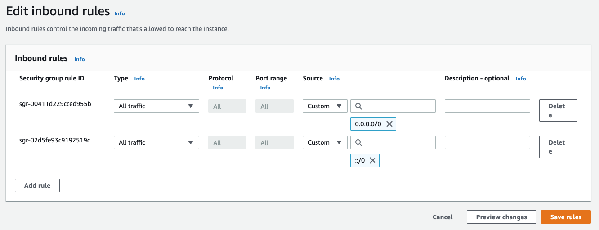

# Seed & Lead Impact App

# Release Notes - Version 1.0
## New Features
- Teacher account creation added 
- Teacher password reset via email ability added 
- Ability for teacher and student to log in 
- New dashboard view for teachers and students with campaign, recent work, and leaf progress tracker 
- Manage class page for teachers to create classes and add/remove students 
- Create campaign page for teachers to set class campaigns 
- A view overall class progress page for teachers 
- Log work page for students to log environmental work 
- New personal goals page for students 
- View detailed progress page for students 
## Bug Fixes
- Fixed dashboard leaf not tracking progress correctly 
- Fixed dashboard showing incorrect dates for campaigns 
- Fixed dashboard crashing when no campaigns are assigned 
- Fixed login page redirecting to home screen when correct login credentials provided 
- Fixed view progress page progress bars showing incorrect percentage 
- Fixed teacher’s dashboards showing incorrect class information 
- Fixed dashboard not displaying students’ goals 
## Known Bugs
- Teacher’s manage classes page crashes when attempting to add student with no classes already created

# Install Guide
This install guide walks through how to setup the database in AWS and how to deploy the code into Heroku for the frontend and backend.
## Pre-requisites and Dependencies
Computer pre-requisites are Python 3.0+, Git, mySQL, and Node.js installed
1. Clone the project via github
    - `git clone https://github.com/harrisonrsmth/SLI-App-H-Brans-1104.git`

2. Install the frontend dependencies and run the server
    - `cd frontend`
    - `npm install`
    - `npm start`

3. Install backend dependencies and run server:
    - In another terminal window:
    - `cd backend`
    - `pip install -r requirements.txt`
    - `export FLASK_APP=backend`
    - `flask run`

Now the application should be running locally!

## AWS Database Setup
The database that backs our application is hosted on AWS’s Relational Database Service. This means that we can create a relational database in MySQL that is stored in the cloud through AWS. For the purpose of delivering the web app, we are hosting a temporary database on a personal AWS free account to make sure that our web app works properly once it is deployed. However, moving forward, you will need to create your own AWS account that may or may not be free to host the database that will be used in the future. First, you must create your account. 
1. To make a free tier account that lasts for 12 months, go [here](https://aws.amazon.com/free/?trk=ps_a131L0000085EJvQAM&trkCampaign=acq_paid_search_brand&sc_channel=ps&sc_campaign=acquisition_US&sc_publisher=google&sc_category=core-main&sc_country=US&sc_geo=NAMER&sc_outcome=acq&sc_detail=aws&sc_content=Brand_Core_aws_e&sc_segment=432339156150&sc_medium=ACQ-P|PS-GO|Brand|Desktop|SU|Core-Main|Core|US|EN|Text&s_kwcid=AL!4422!3!432339156150!e!!g!!aws&ef_id=CjwKCAiAhreNBhAYEiwAFGGKPAPSuFAA2jIUrRswUUbw24t-OXqu0Aa88QY6tEYmCMkcLpp4W95yLxoChrIQAvD_BwE:G:s&s_kwcid=AL!4422!3!432339156150!e!!g!!aws&all-free-tier.sort-by=item.additionalFields.SortRank&all-free-tier.sort-order=asc&awsf.Free%20Tier%20Types=*all&awsf.Free%20Tier%20Categories=*all)
    - Hosting a database on this free account will allow you 750 hours per month (a month is around 740 hours) of hosting a database with micro storage (20GB). If the scale of this application is relatively small, this option should be adequate, but if the intention is to scale, paid options with more storage and host time can be found [here](https://aws.amazon.com/rds/mysql/pricing/?pg=pr&loc=2).
    - Each of these options can be later selected when creating the actual database, just know they will cost more than the free version 
2. Click “Create a Free Account,” and enter the information prompted. You will be required to input credit card information to verify identity and to have on file in case your usage exceeds the free tier limit. 
3. Once you have created your account, you should be taken to the AWS Management Console. In the top right corner next to your name, you should see that the selected region is “Ohio.” If not, click the dropdown and select “US East (Ohio).” This is where the data warehouse is that physically stores all your data. 
4. Follow the “Introduction” and “Create a MySQL DB Instance” sections of [this](https://aws.amazon.com/getting-started/hands-on/create-mysql-db/) tutorial from AWS to create the database (a few edits/notes have been made below):
    - In step a), they set the region to “N. Virginia,” but leave it as “Ohio.” 
    - In step c), select the Version to be MySQL 8.0.23, and in the “Templates” section, if you want to begin with the free tier, select “Free tier,” otherwise, select “Production,” which will have many more storage options that are defined later. 
    - In step d), in the “DB instance size” section, if you selected “Free tier” earlier in step c), you will only have the option for db.t2.micro, but if you chose “Production,” you will have many more options. The pricing for these options can be found [here](https://aws.amazon.com/rds/mysql/pricing/?pg=pr&loc=2). With the nature of the application however, we do not foresee there needing to be an incredible amount of storage space because the data we store is quite minimal and small. If you do select the free tier and end up needing more space in the future, as more storage is used up, the database will grow, and you will be billed accordingly.  
    - In step d) for the “Enable storage autoscaling” section, check the box so that if necessary, the database can grow as storage is used. 
    - In step e), under the “Database options,” for “Database name,” enter “sli_databse.” 
    - Once you have created the database instance, you are done with that tutorial. 
5. Now, we will set permissions so that the web app can access the database.  
6. From the AWS Management Console, where we began step 3, click on “RDS” under “Database,” which is under “All services.”

7. Click on “DB Instances (1/20).

8. Click on the Instance you just created. 
9. You will be taken to this summary page which contains all the information you will need regarding the database. The “Endpoint” in the red box will be used later when configuring backend server variables.

10. Scroll down to “Security group rules” and click on the top entry that has “CIDR/IP – Inbound” as the “Type.”

11. Select “Inbound rules” and then “Edit Inbound rules.”

12. Set the Inbound rules to the following and click “Save rules”

13. The database server should now be properly configured, so now we will connect to the server and create the database with all the necessary tables. 
14. Go to the following link: [https://dev.mysql.com/downloads/](https://dev.mysql.com/downloads/). If you are on windows, click the option that says, “MySQL Installer for Windows.” If you are on Mac OS, first install “MySQL Community Server,” and then “MySQL Workbench.” Follow the instructions until everything is properly installed. 
15. Once you have Workbench and the MySQL Community Server installed, open MySQL Workbench. You should see a welcome screen and next to where it says, “MySQL Connections,” there should be a plus sign. Click the “+” and create a connection name. Then copy and paste the endpoint noted here in step 9 into the “Hostname” and enter the username and password that you used as the Master username and password when creating the AWS server. Click “Test Connection” to ensure you are able to connect.

16. You should now see this as a connection option. Click on it to establish a connection, and then it will take you to a query editor.

17. From the .zip file containing all of the code, go to the “backend” folder and right click on backend.sql and select “Open With… MySQL Workbench.” Then, click the lightning bolt on the left to execute the commands that will create the database.

18. Then, do the same thing with update_database.sql and run the script using the same lightning bolt. Once you have done this, the database should be created on the server and ready to use! To ensure everything has executed correctly, click the refresh button on the left side next to “Schemas,” and then expand “sli_database” and “Tables.” You should see the following table names:

19. This completes the set up for the database! 

## Deploy Frontend and Backend Server to Heroku
1. Create Heroku Account: [https://www.heroku.com/](https://www.heroku.com/)
2. Login to Heroku on terminal
    - `npm install -g heroku`
    - `heroku --version`
    - `heroku login`
    - `cd ~/SLI-APP-BRAN`
3. Deploy backend to Heroku	
    - `heroku create sli-backend`
    - `git add .`
    - `git commit –m “Backend Deployment"`
    - `heroku git:remote -a sli-backend`
    - `heroku buildpacks:set heroku/python`
4. Add Configuration Variables on Heroku Dashboard
    - Go to your Heroku Dashboard and add these variables under the sli-backend dashbaord
        - SQL_HOST = AWS endpoint server 
	    - SQL_USER = SQL username from AWS Database
        - SQL_PASSWORD = SQL password from AWS Database
	    - EMAIL =  your email 
        - EMAIL_PASSWORD = your email password
        - ENCRYPTION-KEY = your encryption key
    
    - `git subtree push --prefix backend heroku master`
5. Deploy frontend to Heroku
    - `npm install -g serve`
    - Edit the URL at frontend/src/api/api.js line 4: url = "https://sli-server.herokuapp.com" (listing to the backend url)
    - Edit the package.json "scripts" to 
    	`"scripts": {
	    "dev": "react-scripts start", 
	    "start": "serve -s build",
	    "build": "react-scripts build",
	    "test": "react-scripts test --env=jsdom",
	    "eject": "react-scripts eject",
	    "heroku-postbuild": "npm run build"
	  }`
    - `heroku create sli-frontend`
    - `git add .`
    - `git commit -m "Frontend Deployment"`
    - `heroku git:remote -a sli-frontend`
    - `heroku buildpacks:set heroku/nodejs`
    - `git subtree push --prefix frontend heroku master`
6. Your app should now be deployed online! You should be able to access it on the link provided in the Heroku Dashboard

# Troubleshooting
Here are some common problems and their solutions

### SQL Connection Error on Startup/Unable to Connect to Database
When deploying the backend, the code may fail to run due to an "connection error"
- Solution: Double check that the SQL host name, username, and password are correct on the Heroku dashboard. Ensure the AWS server says “Available,” and all credentials have been entered correctly. Also ensure that proper Inbound security settings have been configured on the AWS server.

### Uncaught Promise Error when accessing webpage
When attempting to access a webpage, an error may occur that says "error: unhandled promise"
- Solution: The website is unable to pull information from the database. Try restarting the sql database and the backend deployment.

### Pip Package not installed
If in the command line/terminal you receive a message saying “____ command not found,” be sure the proper package is installed via pip.
- Solution: `pip install MISSING_PACKAGE`

### Pip is not installed
The pip package is not installed
- Solution: Follow the instructions [here](https://pip.pypa.io/en/stable/installation/) under get-pip.pu

### Python is not installed 
Python is not found on computer
- Solution: If python is not installed, use the following [link](https://www.python.org/downloads/) to download Python 3.8.0 under “Looking for a specific release?"

